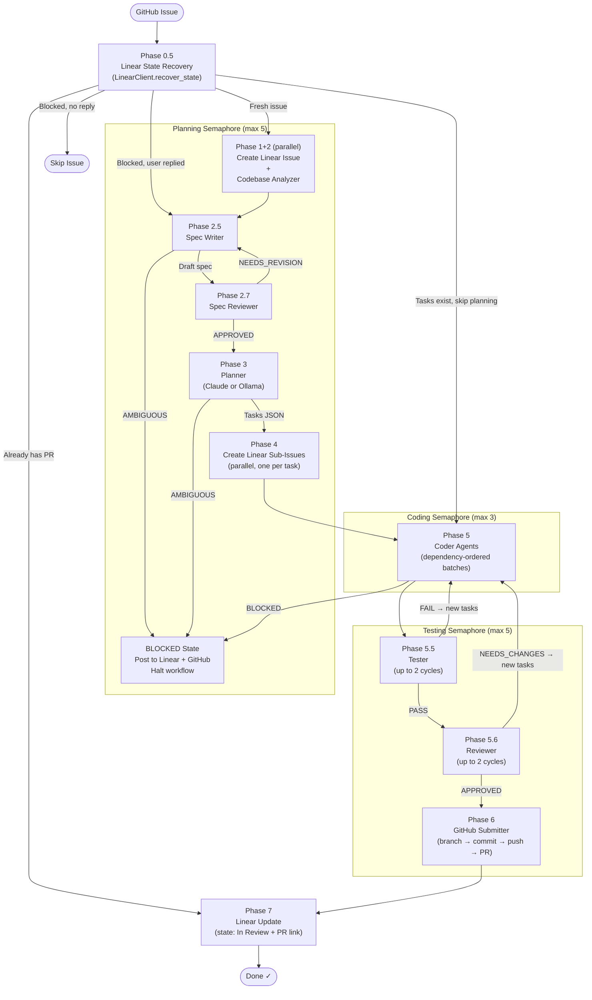
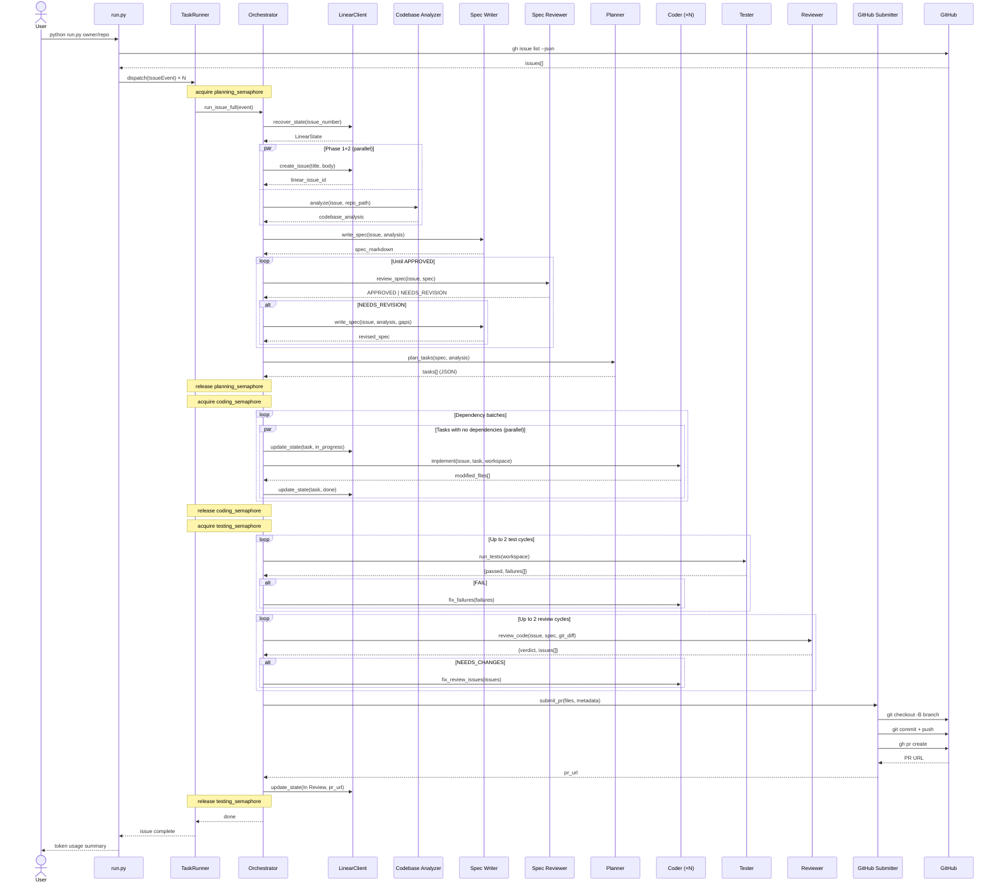

# githubFixer — Architecture & Agent Flow

> A multi-agent autonomous system that resolves GitHub issues end-to-end: analyze → spec → plan → code → test → review → PR → Linear tracking.

---

## Table of Contents

1. [System Overview](#1-system-overview)
2. [Project File Map](#2-project-file-map)
3. [Agent Roster](#3-agent-roster)
4. [Orchestration State Machine](#4-orchestration-state-machine)
5. [Agent Interaction Sequence](#5-agent-interaction-sequence)
6. [Concurrency & Semaphore Model](#6-concurrency--semaphore-model)
7. [Data Flow](#7-data-flow)
8. [External Integrations](#8-external-integrations)
9. [Configuration Reference](#9-configuration-reference)
10. [State Recovery & Resumption](#10-state-recovery--resumption)
11. [Security Model](#11-security-model)

---

## 1. System Overview

**githubFixer** takes open GitHub issues and resolves them autonomously — from reading the issue to merging a pull request — using a pipeline of specialized Claude agents coordinated by a Python orchestrator.

### Key Design Principles

| Principle | Implementation |
|-----------|---------------|
| **Agent specialization** | Each agent has one job; no agent does everything |
| **Parallel execution** | Issues processed concurrently; tasks within an issue run in dependency-ordered batches |
| **State recovery** | Phase 0.5 checks Linear before doing any work — resumes interrupted workflows |
| **Cost optimization** | Tool-free agents (Planner, Spec Reviewer) can run on local Ollama instead of Claude |
| **Human checkpoints** | BLOCKED state posts to GitHub/Linear and halts until a human replies |

### High-Level Flow

```
GitHub Issues  ──►  githubFixer  ──►  Pull Requests
                        │
                        └──►  Linear (tracking + status)
```

---

## 2. Project File Map

```
githubFixer/
│
├── run.py                    # CLI entry point — parses args, fetches issues, dispatches tasks
├── config.py                 # Pydantic BaseSettings — all env vars and defaults
├── models.py                 # IssueEvent data model (GitHub issue → internal representation)
├── task_runner.py            # Async dispatcher — manages semaphores, dedup, concurrency
├── workspace.py              # Git worktree isolation — one worktree per issue
├── linear_client.py          # Direct GraphQL API client for Linear (replaces LLM agent)
├── security.py               # Bash command hook — blocks dangerous shell commands
├── prompts.py                # Utility: loads .md files from agents/prompts/
├── token_tracker.py          # Tracks Claude API token usage across all agents
├── requirements.txt          # Python dependencies
│
├── agents/
│   ├── definitions.py        # AgentDefinition dataclass + AGENT_MODELS / CODEX_AGENT_MODELS dicts
│   ├── orchestrator.py       # Main state machine — IssueWorkflow class (~1750 lines)
│   ├── anthropic_client.py   # Direct Anthropic API client with full agentic tool loop
│   ├── codex_client.py       # OpenAI Codex CLI subprocess adapter (optional backend)
│   ├── ollama_client.py      # OpenAI-compat client for local Ollama inference
│   ├── tools.py              # Tool schemas + Python executors (Read/Write/Edit/Glob/Grep/Bash)
│   ├── types.py              # Local message dataclasses (AssistantMessage, TextBlock, etc.)
│   │
│   └── prompts/              # System prompts for each agent (Markdown)
│       ├── orchestrator.md       # Legacy reference (logic now in Python)
│       ├── codebase_analyzer.md  # Analyzes repo structure, tech stack, approach
│       ├── spec_writer.md        # Writes structured project specification
│       ├── spec_reviewer.md      # Validates spec completeness against issue
│       ├── planner.md            # Breaks spec into ordered implementation tasks
│       ├── coder.md              # Implements code changes per task
│       ├── tester.md             # Runs test suite, reports failures as JSON
│       ├── reviewer.md           # Code review: 5-point check against spec
│       └── github_submitter.md   # Creates branch, commits, pushes, opens PR
│
└── docs/
    └── ARCHITECTURE.md       # This file
```

---

## 3. Agent Roster

### Summary Table

| # | Agent | Phase | Default Model | Tools | Ollama? |
|---|-------|-------|--------------|-------|---------|
| 1 | Codebase Analyzer | 2 | Haiku | Read, Glob, Grep | No |
| 2 | Spec Writer | 2.5 | Sonnet | _(none — pure reasoning)_ | No |
| 3 | Spec Reviewer | 2.7 | Haiku | _(none — pure reasoning)_ | Optional |
| 4 | Planner | 3 | Haiku | _(none — pure reasoning)_ | Optional |
| 5 | Coder | 5 | Sonnet | Read, Write, Edit, Glob, Grep, Bash | No |
| 6 | Tester | 5.5 | Sonnet | Bash, Read | No |
| 7 | Reviewer | 5.6 | Sonnet | Bash, Read, Glob, Grep | No |
| 8 | GitHub Submitter | 6 | Haiku | Bash, Read | No |

---

### Agent Detail Cards

<details>
<summary><strong>Agent 1 — Codebase Analyzer</strong></summary>

**Role:** Deep-reads the repository to understand the codebase before any planning begins.

**Input:**
- GitHub issue title + body
- Repository path (git worktree)

**Output:** Structured analysis containing:
- Relevant files and their roles
- Tech stack and frameworks
- Existing patterns to follow
- Recommended implementation approach

**Behavior:** Runs once per issue during Phase 2. Has read-only tool access (Read, Glob, Grep) — cannot modify files.

**Retry:** None — single pass, results feed into Spec Writer.

</details>

<details>
<summary><strong>Agent 2 — Spec Writer</strong></summary>

**Role:** Converts the GitHub issue + codebase analysis into a formal project specification.

**Input:**
- GitHub issue (title + body)
- Codebase Analyzer output

**Output:** One of:
- A structured Markdown spec covering: goals, constraints, acceptance criteria, files to change
- The literal string `AMBIGUOUS` if the issue is too vague to spec

**Behavior:** If `AMBIGUOUS` is returned, the orchestrator posts a clarifying question on GitHub and enters the BLOCKED state.

**Retry:** If Spec Reviewer sends back `NEEDS_REVISION`, Spec Writer is called again with the gap list.

</details>

<details>
<summary><strong>Agent 3 — Spec Reviewer</strong></summary>

**Role:** Validates the spec covers all requirements stated in the GitHub issue — acts as a quality gate.

**Input:**
- GitHub issue (title + body)
- Draft spec from Spec Writer

**Output:**
- `APPROVED` — spec is complete
- `NEEDS_REVISION` with a list of gaps

**Behavior:** Pure reasoning, no tool access. Can optionally run on Ollama (`USE_OLLAMA_FOR_SPEC_REVIEWER=true`) to reduce cost.

**Retry:** Loops back to Spec Writer until `APPROVED` (no hard limit set, but Spec Writer prompt guards against infinite loops).

</details>

<details>
<summary><strong>Agent 4 — Planner</strong></summary>

**Role:** Breaks the approved spec into a set of concrete, ordered implementation tasks.

**Input:**
- Approved project spec
- Codebase Analyzer output

**Output:** A JSON array of tasks, each with:
```json
{
  "title": "Add rate limiting middleware",
  "description": "...",
  "files_hint": ["src/middleware/rate_limit.py"],
  "acceptance": "...",
  "depends_on": []
}
```

**Behavior:** Produces 1–8 tasks. Tasks with empty `depends_on` can run in parallel. Can run on Ollama (`USE_OLLAMA_FOR_PLANNER=true`). Falls back to Claude if Ollama is unreachable.

**Blocked case:** If the planner returns `AMBIGUOUS`, the workflow halts.

</details>

<details>
<summary><strong>Agent 5 — Coder</strong></summary>

**Role:** Implements code changes for a single task within an isolated git worktree.

**Input:**
- GitHub issue context
- Codebase analysis
- Task description (title, description, acceptance criteria, files_hint)

**Output:**
- Actual file modifications (via Write/Edit tools)
- List of modified files

**Behavior:** Has full read/write/bash access to the worktree. Runs inline smoke tests where possible. Multiple Coder instances run in parallel when tasks have no dependencies between them.

**Blocked case:** If the Coder returns `BLOCKED` (e.g., task is impossible given current state), the workflow halts.

</details>

<details>
<summary><strong>Agent 6 — Tester</strong></summary>

**Role:** Runs the full test suite and reports structured results.

**Input:**
- Repository path (worktree with all coding done)

**Output:**
```json
{
  "passed": false,
  "failures": [
    {"test": "test_auth.py::test_login", "error": "AssertionError: ..."}
  ]
}
```

**Behavior:** Detects the test runner (pytest, jest, go test, etc.) from the repo. Runs up to 2 remediation cycles — on failure, new "Fix:" tasks are created and executed before re-running.

**Circuit breaker:** If >50% of the same failures repeat, the workflow is blocked to avoid infinite remediation loops.

</details>

<details>
<summary><strong>Agent 7 — Reviewer</strong></summary>

**Role:** Performs a structured code review of all changes against the original spec.

**Input:**
- GitHub issue + project spec
- `git diff` of all changes in the worktree

**Output:**
```json
{
  "verdict": "NEEDS_CHANGES",
  "issues": [
    {"severity": "high", "file": "src/auth.py", "comment": "Missing input validation"}
  ]
}
```

**Behavior:** Runs a 5-point checklist (correctness, spec coverage, security, test coverage, code quality). Up to 2 review-fix cycles before failing the workflow.

</details>

<details>
<summary><strong>Agent 8 — GitHub Submitter</strong></summary>

**Role:** Creates the branch, commits all changes, pushes, and opens the pull request.

**Input:**
- Modified file list
- Issue metadata (number, title, repo)
- Branch name slug

**Output:** Pull request URL

**Behavior:** Uses `git` and `gh` CLI via Bash. Writes a structured PR description linking back to the issue. Runs once — no retry logic (failure surfaces as an error).

</details>

---

## 4. Orchestration State Machine



---

## 5. Agent Interaction Sequence



---

## 6. Concurrency & Semaphore Model

githubFixer processes multiple issues simultaneously. Three semaphores prevent resource contention:

```
┌─────────────────────────────────────────────────────────────────┐
│                        Task Runner                              │
│                                                                 │
│  Issue A ──┐                                                    │
│  Issue B ──┤──► planning_semaphore (max 5)                      │
│  Issue C ──┤       └─► spec/plan phases run concurrently        │
│  Issue D ──┘                                                    │
│                                                                 │
│  Issue A ──┐                                                    │
│  Issue B ──┤──► coding_semaphore (max 3)                        │
│  Issue C ──┘       └─► code changes are resource-intensive      │
│                                                                 │
│  Issue A ──┐                                                    │
│  Issue B ──┤──► testing_semaphore (max 5)                       │
│  Issue C ──┤       └─► test + review + PR phases                │
│  Issue D ──┘                                                    │
└─────────────────────────────────────────────────────────────────┘
```

### Within-Issue Parallelism (Task Batches)

The Planner produces tasks with a `depends_on` field. The orchestrator uses this to form **dependency batches** and runs each batch in parallel:

```
Task A (depends_on: [])  ─┐
Task B (depends_on: [])  ─┤─► Batch 0 — all run in parallel
Task C (depends_on: [])  ─┘

Task D (depends_on: [A]) ─┐
Task E (depends_on: [B]) ─┘─► Batch 1 — runs after Batch 0 completes

Task F (depends_on: [D,E]) ─► Batch 2 — runs after Batch 1 completes
```

File conflict detection prevents two tasks in the same batch from writing to the same file.

---

## 7. Data Flow

```
┌──────────────────────────────────────────────────────────────┐
│  INPUT                                                        │
│  GitHub Issue (number, title, body, repo_full_name)          │
└────────────────────────────┬─────────────────────────────────┘
                             │
                             ▼
┌─────────────────────────────────────────────────────────────┐
│  IssueEvent (models.py)                                      │
│  + branch_name, branch_slug, clone_url, html_url            │
└────────────────────────────┬────────────────────────────────┘
                             │
                             ▼
┌────────────────────────────────────────────────────────────┐
│  TaskRunner.dispatch()                                      │
│  • Deduplicates by issue number                             │
│  • Creates asyncio.Task                                     │
│  • Manages semaphore acquisition order                      │
└────────────────────────────┬───────────────────────────────┘
                             │
                             ▼
┌────────────────────────────────────────────────────────────┐
│  IssueWorkflow (orchestrator.py)                            │
│                                                             │
│  plan()                   →  codebase_analysis: str        │
│                           →  spec: str (Markdown)          │
│                           →  tasks: Task[]                  │
│                                                             │
│  code()                   →  modified_files: str[]         │
│                           →  worktree with changes         │
│                                                             │
│  test_review_submit()     →  pr_url: str                   │
│                           →  Linear updated                 │
└────────────────────────────┬───────────────────────────────┘
                             │
                             ▼
┌────────────────────────────────────────────────────────────┐
│  OUTPUT                                                     │
│  • GitHub Pull Request (branch → PR)                        │
│  • Linear Issue (parent + sub-issues, state: In Review)     │
│  • Token usage summary                                      │
└────────────────────────────────────────────────────────────┘
```

### Key Data Structures

**`IssueEvent`** — the input unit, created from `gh issue list --json`:
```
number, title, body, repo_full_name, repo_owner,
clone_url, html_url, force
→ derived: branch_name, branch_slug
```

**`Task`** — one unit of implementation work:
```
title, description, files_hint[], acceptance, depends_on[]
→ tracked: linear_id, linear_url, status, modified_files[]
```

**`LinearState`** — recovered from Linear at Phase 0.5:
```
found, blocked, in_review, pr_url,
linear_issue_id, linear_project_id, tasks[]
```

---

## 8. External Integrations

### GitHub (via `gh` CLI)

| Operation | Command | Phase |
|-----------|---------|-------|
| List open issues | `gh issue list --json` | CLI startup |
| Fetch single issue | `gh issue view N --json` | CLI startup |
| Post clarifying comment | `gh issue comment --body` | BLOCKED state |
| Check PR status | `gh pr view --json state` | Phase 0.5 recovery |
| Create branch + push | `git checkout -B; git push` | Phase 6 |
| Open pull request | `gh pr create --title --body` | Phase 6 |

### Linear (GraphQL API — `linear_client.py`)

| Operation | GraphQL | Phase |
|-----------|---------|-------|
| Recover workflow state | Custom reconstruction query | Phase 0.5 |
| Create parent issue | `issueCreate` | Phase 1 |
| Create sub-issue per task | `issueCreate` (with parent) | Phase 4 |
| Update issue state | `issueUpdate` | Phases 5, 7, BLOCKED |
| Add comment | `commentCreate` | Phase 7, BLOCKED |
| List/create projects | `projects`, `projectCreate` | Phase 1 |

> Note: Linear was originally handled by a dedicated LLM agent. It was replaced with a direct GraphQL client to eliminate ~28 unnecessary LLM API calls per workflow.

### Ollama (optional — `ollama_client.py`)

Ollama is an OpenAI-compatible local inference server used for **tool-free agents** (pure reasoning, no file access needed):

| Agent | Env Var | Default |
|-------|---------|---------|
| Planner | `USE_OLLAMA_FOR_PLANNER` | `false` |
| Spec Reviewer | `USE_OLLAMA_FOR_SPEC_REVIEWER` | `false` |

- Endpoint: `http://localhost:11434/v1/chat/completions`
- Default model: `qwen2.5:14b` (configurable via `OLLAMA_MODEL`)
- If Ollama is unreachable, both agents fall back to Claude automatically

---

## 9. Configuration Reference

All settings are loaded from `.env` via Pydantic `BaseSettings` (`config.py`).

### Required

| Variable | Purpose |
|----------|---------|
| `LINEAR_API_KEY` | Linear GraphQL API authentication token |
| `LINEAR_TEAM_ID` | UUID of the Linear team that owns created issues |
| `ANTHROPIC_API_KEY` | Anthropic API key (required when `AGENT_BACKEND=anthropic`, the default) |

### Backend Selection

| Variable | Default | Options |
|----------|---------|---------|
| `AGENT_BACKEND` | `anthropic` | `anthropic` — direct API; `codex` — Codex CLI |
| `CODER_AGENT_BACKEND` | _(use global)_ | Per-agent override of `AGENT_BACKEND` |
| `TESTER_AGENT_BACKEND` | _(use global)_ | Per-agent override |
| `REVIEWER_AGENT_BACKEND` | _(use global)_ | Per-agent override |
| `ANALYZER_AGENT_BACKEND` | _(use global)_ | Per-agent override |
| `PLANNER_AGENT_BACKEND` | _(use global)_ | Per-agent override |
| `SPEC_WRITER_AGENT_BACKEND` | _(use global)_ | Per-agent override |
| `SPEC_REVIEWER_AGENT_BACKEND` | _(use global)_ | Per-agent override |
| `GITHUB_AGENT_BACKEND` | _(use global)_ | Per-agent override |
| `MAX_TOKENS_PER_AGENT` | `16384` | Max output tokens per Anthropic API call |

### Model Selection

| Variable | Default | Used By |
|----------|---------|---------|
| `CODING_AGENT_MODEL` | `claude-sonnet-4-6` | Coder, Tester, Reviewer |
| `ANALYZER_AGENT_MODEL` | `claude-haiku-4-5-20251001` | Codebase Analyzer |
| `PLANNER_AGENT_MODEL` | `claude-haiku-4-5-20251001` | Planner (Claude fallback) |
| `SPEC_WRITER_AGENT_MODEL` | `claude-sonnet-4-6` | Spec Writer |
| `SPEC_REVIEWER_AGENT_MODEL` | `claude-haiku-4-5-20251001` | Spec Reviewer (Claude fallback) |

### Concurrency

| Variable | Default | Effect |
|----------|---------|--------|
| `MAX_CONCURRENT_ISSUES` | `3` | Coding semaphore cap |
| `MAX_CONCURRENT_TESTERS` | `5` | Testing semaphore cap |
| `MAX_CONCURRENT_PLANNERS` | `5` | Planning semaphore cap |

### Retry Limits

| Variable | Default | Controls |
|----------|---------|---------|
| `MAX_REMEDIATION_CYCLES` | `3` | Test-fix loop iterations |
| `MAX_REVIEW_CYCLES` | `2` | Code review-fix loop iterations |

### Codex CLI Backend

| Variable | Default | Purpose |
|----------|---------|---------|
| `CODEX_CODER_MODEL` | `o4-mini` | OpenAI model for Coder agent |
| `CODEX_TESTER_MODEL` | `o4-mini` | OpenAI model for Tester agent |
| `CODEX_REVIEWER_MODEL` | `o4-mini` | OpenAI model for Reviewer agent |
| `CODEX_ANALYZER_MODEL` | `o4-mini` | OpenAI model for Analyzer agent |
| `CODEX_PLANNER_MODEL` | `o4-mini` | OpenAI model for Planner agent |
| `CODEX_SPEC_WRITER_MODEL` | `o4-mini` | OpenAI model for Spec Writer agent |
| `CODEX_SPEC_REVIEWER_MODEL` | `o4-mini` | OpenAI model for Spec Reviewer agent |
| `CODEX_GITHUB_MODEL` | `o4-mini` | OpenAI model for GitHub Submitter agent |
| `CODEX_TIMEOUT_SECONDS` | `600` | Per-call subprocess timeout (seconds) |

### Ollama (Local Inference)

Ollama is a valid backend for **tool-free agents** — those that do pure reasoning with no file or shell access. It runs locally at zero API cost and falls back to the Anthropic API automatically if unreachable.

| Variable | Default | Purpose |
|----------|---------|---------|
| `USE_OLLAMA_FOR_PLANNER` | `false` | Route Planner to local Ollama |
| `USE_OLLAMA_FOR_SPEC_REVIEWER` | `false` | Route Spec Reviewer to local Ollama |
| `OLLAMA_MODEL` | `qwen2.5:14b` | Which Ollama model to use |
| `OLLAMA_BASE_URL` | `http://localhost:11434` | Ollama server endpoint |

---

## 10. State Recovery & Resumption

Phase 0.5 runs before any work begins. It queries Linear for an existing issue matching the GitHub issue number, then decides what to do:

```
LinearClient.recover_state(issue_number)
          │
          ▼
    Issue found?
    ├── NO  →  proceed from Phase 1 (fresh start)
    └── YES →
          │
          ├── PR already open?
          │   └── YES → jump to Phase 7 (just update Linear state)
          │
          ├── State = BLOCKED?
          │   ├── User replied on GitHub since blocked?
          │   │   └── YES → clear blocked, resume from Phase 2.5
          │   └── NO  → skip this issue entirely
          │
          ├── Tasks already planned (sub-issues exist)?
          │   └── YES → skip planning phases, jump to Phase 5
          │
          └── Otherwise → resume from Phase 1+2
```

This means githubFixer can safely be restarted mid-workflow — it will pick up where it left off without duplicating Linear issues or re-running expensive analysis phases.

---

## 11. Security Model

Each issue gets an isolated git worktree under `/tmp/issue-solver/`. Agent tool access is controlled by the backend:

- **Anthropic API backend** — tools are explicitly declared per agent (e.g. Coder gets Read/Write/Edit/Glob/Grep/Bash; Analyzer gets Read/Glob/Grep only). The Bash executor enforces an allowlist before running any shell command.
- **Codex CLI backend** — uses `--approval-mode full-auto`; tool access is managed natively by the CLI.
- **Ollama backend** — only used for tool-free agents (Planner, Spec Reviewer); no file or shell access.

### Bash Command Hook (`security.py`)

A pre-execution hook intercepts all `Bash` tool calls from agents. Blocked patterns:

| Pattern | Reason |
|---------|--------|
| `rm -rf /` or `rm -rf ~` | Prevent system destruction |
| `git push origin main` | Never force-push the default branch |
| `git push --force` | Prevent overwriting upstream history |
| `sudo` | No privilege escalation |
| `curl ... \| bash` | No arbitrary remote code execution |

Allowed by default:
- All read operations (cat, ls, find, grep, etc.)
- File writes within the worktree
- `git` operations on the feature branch
- `pytest`, `jest`, `go test`, and other standard test runners
- `gh pr create` and other GitHub CLI read/write ops

### Worktree Cleanup

- On **success**: worktree is deleted after the PR is created
- On **failure or BLOCKED**: worktree is preserved at `/tmp/issue-solver/{repo}/{issue_number}/` for manual inspection
